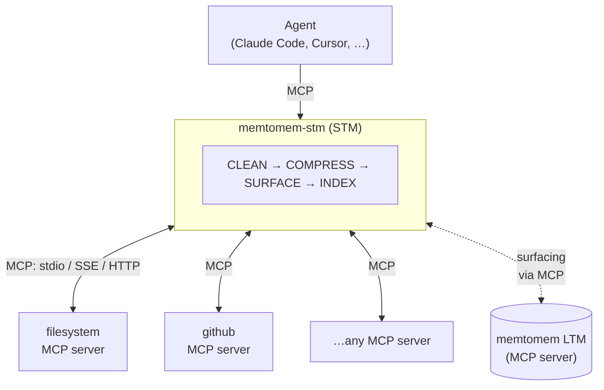

# memtomem-stm

**Official website & docs: [https://memtomem.com](https://memtomem.com)**

[](https://pypi.org/project/memtomem-stm/)
[](https://python.org)
[](LICENSE)
[](CLA.md)

Spend fewer tokens. Remember more. Ship faster.

memtomem-stm is an MCP proxy that typically **cuts token usage by 20–80%** and gives your agent **memory across sessions** — with no changes to your upstream MCP servers.

It sits between your AI agent and its upstream MCP servers, compressing bloated tool responses, caching repeated calls, and automatically surfacing relevant context from prior sessions via a memtomem LTM server.

**You need this if:**
- Your agent **burns tokens** re-reading the same files and search results — STM compresses and caches them (Claude Code, Cursor, Claude Desktop, or any MCP client)
- Your coding sessions **lose context** and the agent re-discovers decisions it already made — STM surfaces prior context automatically via memtomem LTM
- You run custom MCP servers and want **compression, caching, and observability** without changing upstream code — STM is a drop-in proxy layer



## Installation

```bash
pip install memtomem-stm
```

Or with [uv](https://docs.astral.sh/uv/):

```bash
uv tool install memtomem-stm     # install mms / memtomem-stm as global CLI tools
uvx memtomem-stm --help          # or run without installing
uv pip install memtomem-stm      # or install into the active environment
```

memtomem-stm is **independent**: it has no Python-level dependency on memtomem core. To enable proactive memory surfacing, point STM at a running memtomem MCP server (or any compatible MCP server) — communication happens entirely through the MCP protocol.

## Quick Start

`mms` is the short alias for `memtomem-stm-proxy` — both commands are identical, use whichever you prefer.

### 1. Add an upstream MCP server

For first-time setup, run the guided wizard — it prompts for name/prefix/command, optionally probes the server, and prints the MCP-client snippet you'll need in step 2:

```bash
mms init
```

Or add servers non-interactively:

```bash
mms add filesystem \
  --command npx \
  --args "-y @modelcontextprotocol/server-filesystem /home/user/projects" \
  --prefix fs
```

`--prefix` is required: it's the namespace under which the upstream server's tools will appear (e.g. `fs__read_file`). Repeat for each MCP server you want to proxy.

```bash
mms list      # show what you've added
mms status    # show full config + connectivity
```

### 2. Connect your AI client to STM

Point your MCP client at the `memtomem-stm` server instead of the upstream servers directly. For Claude Code:

```bash
claude mcp add memtomem-stm -s user -- memtomem-stm
```

Or add it to a JSON MCP config:

```json
{
  "mcpServers": {
    "memtomem-stm": {
      "command": "memtomem-stm"
    }
  }
}
```

### 3. Use the proxied tools

Your agent now sees proxied tools (`fs__read_file`, `gh__search_repositories`, etc.). Every call goes through the 4-stage pipeline automatically — responses are cleaned, compressed, cached, and (when an LTM server is configured) enriched with relevant memories.

To check what's happening, ask the agent to call `stm_proxy_stats`.

## Tutorial notebooks

> **Try it without wiring into your AI client first.** Six [runnable Jupyter notebooks](notebooks/) walk through setup, compression, memory surfacing, LangChain integration, and observability. Clone the repo, `uv sync`, and `uv run jupyter lab notebooks/` — no external services needed for notebooks 00–03 and 05.

## Key Features

- 🗜️ **Typically 20–80% fewer tokens per tool call** — 10 compression strategies with auto-selection by content type, query-aware budget, and zero-loss progressive delivery → [docs/compression.md](https://github.com/memtomem/memtomem-stm/blob/main/docs/compression.md)
- 🧠 **Your agent remembers** — proactive memory surfacing from prior sessions, gated by relevance threshold, rate limit, dedup, and circuit breaker → [docs/surfacing.md](https://github.com/memtomem/memtomem-stm/blob/main/docs/surfacing.md)
- 💾 **Repeated calls are free** — response cache with TTL and eviction; surfacing re-applied on cache hit so injected memories stay fresh → [docs/caching.md](https://github.com/memtomem/memtomem-stm/blob/main/docs/caching.md)
- 🔍 **See what's happening** — Langfuse tracing, RPS, latency percentiles (p50/p95/p99), error classification, per-tool metrics → [docs/operations.md#observability](https://github.com/memtomem/memtomem-stm/blob/main/docs/operations.md#observability)
- 📈 **Scale to teams** — `PendingStore` protocol with InMemory (default) or SQLite-shared backend for multi-instance deployments → [docs/operations.md#horizontal-scaling](https://github.com/memtomem/memtomem-stm/blob/main/docs/operations.md#horizontal-scaling)
- 🛡️ **Production-safe** — circuit breaker, retry with backoff, write-tool skip, query cooldown, dedup, sensitive content auto-detection → [docs/operations.md#safety--resilience](https://github.com/memtomem/memtomem-stm/blob/main/docs/operations.md#safety--resilience)

## Documentation

| Guide | Topic |
|-------|-------|
| [Pipeline](https://github.com/memtomem/memtomem-stm/blob/main/docs/pipeline.md) | How responses flow through the 4-stage pipeline |
| [Compression](https://github.com/memtomem/memtomem-stm/blob/main/docs/compression.md) | All 10 strategies — pick the right one for your content |
| [Surfacing](https://github.com/memtomem/memtomem-stm/blob/main/docs/surfacing.md) | How agents recall prior context automatically |
| [Caching](https://github.com/memtomem/memtomem-stm/blob/main/docs/caching.md) | Skip repeated work with response caching |
| [Configuration](https://github.com/memtomem/memtomem-stm/blob/main/docs/configuration.md) | Tune settings without touching code |
| [CLI](https://github.com/memtomem/memtomem-stm/blob/main/docs/cli.md) | CLI commands and the 10 MCP tools |
| [Operations](https://github.com/memtomem/memtomem-stm/blob/main/docs/operations.md) | Run safely in production — scaling, observability, privacy |
| [Custom Integration](https://github.com/memtomem/memtomem-stm/blob/main/docs/custom-integration.md) | Extend STM with custom file indexers |
| [bench_qa](https://github.com/memtomem/memtomem-stm/blob/main/docs/bench_qa.md) | Scenario harness, advisory LLM judge, and determinism gate |

## Development

```bash
uv sync                                                    # install dev deps
uv run pytest -m "not ollama and not bench_qa_meta and not bench_qa_llm_judge"   # tests (CI filter)
uv run ruff check src && uv run ruff format --check src    # lint (required)
uv run mypy src                                            # typecheck (advisory)
```

CI runs the same commands on every PR via `.github/workflows/ci.yml`. Lint (`ruff check` + `ruff format --check`) and tests must pass; mypy is advisory.

## License

[Apache License 2.0](LICENSE). Contributions are accepted under the terms of the [Contributor License Agreement](CLA.md).
