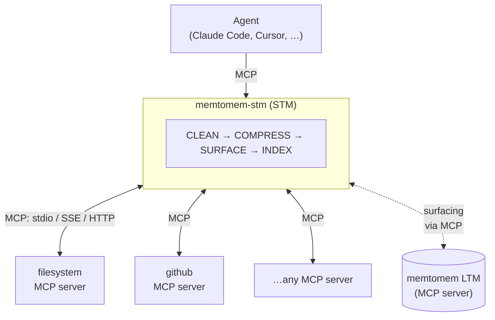

# memtomem-stm

**Official website & docs: [https://memtomem.com](https://memtomem.com)**

[](https://pypi.org/project/memtomem-stm/)
[](https://python.org)
[](LICENSE)
[](CLA.md)

Short-term memory proxy gateway with **proactive memory surfacing** for AI agents.

Sits between your AI agent and upstream MCP servers. Compresses responses to save tokens, caches results, and automatically surfaces relevant memories from a memtomem LTM server.

**Built for:**
- Agents (Claude Code, Cursor, Claude Desktop, etc.) running multiple MCP servers and burning tokens on noisy upstream responses
- Long-running coding sessions where the agent should *recall* prior decisions instead of re-searching
- Teams running custom MCP servers that need a proxy layer for compression, caching, and observability — no upstream code changes required



## Installation

```bash
pip install memtomem-stm
```

Or with [uv](https://docs.astral.sh/uv/):

```bash
uv tool install memtomem-stm     # install mms / memtomem-stm as global CLI tools
uvx memtomem-stm --help          # or run without installing
uv pip install memtomem-stm      # or install into the active environment
```

memtomem-stm is **independent**: it has no Python-level dependency on memtomem core. To enable proactive memory surfacing, point STM at a running memtomem MCP server (or any compatible MCP server) — communication happens entirely through the MCP protocol.

## Quick Start

`mms` is the short alias for `memtomem-stm-proxy` — both commands are identical, use whichever you prefer.

### 1. Add an upstream MCP server

```bash
mms add filesystem \
  --command npx \
  --args "-y @modelcontextprotocol/server-filesystem /home/user/projects" \
  --prefix fs
```

`--prefix` is required: it's the namespace under which the upstream server's tools will appear (e.g. `fs__read_file`). Repeat for each MCP server you want to proxy.

```bash
mms list      # show what you've added
mms status    # show full config + connectivity
```

### 2. Connect your AI client to STM

Point your MCP client at the `memtomem-stm` server instead of the upstream servers directly. For Claude Code:

```bash
claude mcp add memtomem-stm -s user -- memtomem-stm
```

Or add it to a JSON MCP config:

```json
{
  "mcpServers": {
    "memtomem-stm": {
      "command": "memtomem-stm"
    }
  }
}
```

### 3. Use the proxied tools

Your agent now sees proxied tools (`fs__read_file`, `gh__search_repositories`, etc.). Every call goes through the 4-stage pipeline automatically — responses are cleaned, compressed, cached, and (when an LTM server is configured) enriched with relevant memories.

To check what's happening, ask the agent to call `stm_proxy_stats`.

## Tutorial notebooks

Want to see STM's behavior without wiring it into Claude Code first? The [`notebooks/`](notebooks/) directory contains six runnable Jupyter notebooks: a CLI-MCP prelude (00), quickstart setup (01), selective compression (02), memory surfacing (03), a LangChain agent integration (04), and observability/Langfuse tracing (05). Clone the repo, run `uv sync`, and `uv run jupyter lab notebooks/` — no external services required for notebooks 00–03 and 05.

## Key Features

- 🗜️ **10 compression strategies** with auto-selection by content type, query-aware budget allocation, and zero-loss progressive delivery → [docs/compression.md](https://github.com/memtomem/memtomem-stm/blob/main/docs/compression.md)
- 🧠 **Proactive memory surfacing** from a memtomem LTM server, gated by relevance threshold, rate limit, dedup, and circuit breaker → [docs/surfacing.md](https://github.com/memtomem/memtomem-stm/blob/main/docs/surfacing.md)
- 💾 **Response caching** with TTL and eviction; surfacing re-applied on cache hit so injected memories stay fresh → [docs/caching.md](https://github.com/memtomem/memtomem-stm/blob/main/docs/caching.md)
- 🔍 **Observability** — Langfuse tracing, RPS, latency percentiles (p50/p95/p99), error classification, per-tool metrics → [docs/operations.md#observability](https://github.com/memtomem/memtomem-stm/blob/main/docs/operations.md#observability)
- 📈 **Horizontal scaling** — `PendingStore` protocol with InMemory (default) or SQLite-shared backend for multi-instance deployments → [docs/operations.md#horizontal-scaling](https://github.com/memtomem/memtomem-stm/blob/main/docs/operations.md#horizontal-scaling)
- 🛡️ **Safety** — circuit breaker, retry with backoff, write-tool skip, query cooldown, session/cross-session dedup, sensitive content auto-detection → [docs/operations.md#safety--resilience](https://github.com/memtomem/memtomem-stm/blob/main/docs/operations.md#safety--resilience)

## Documentation

| Guide | Topic |
|-------|-------|
| [Pipeline](https://github.com/memtomem/memtomem-stm/blob/main/docs/pipeline.md) | The 4-stage CLEAN → COMPRESS → SURFACE → INDEX flow |
| [Compression](https://github.com/memtomem/memtomem-stm/blob/main/docs/compression.md) | All 10 strategies, query-aware compression, progressive delivery, model-aware defaults |
| [Surfacing](https://github.com/memtomem/memtomem-stm/blob/main/docs/surfacing.md) | Memory surfacing engine, relevance gating, feedback loop, auto-tuning |
| [Caching](https://github.com/memtomem/memtomem-stm/blob/main/docs/caching.md) | Response cache and auto-indexing |
| [Configuration](https://github.com/memtomem/memtomem-stm/blob/main/docs/configuration.md) | Environment variables and `stm_proxy.json` reference |
| [CLI](https://github.com/memtomem/memtomem-stm/blob/main/docs/cli.md) | `mms` (= `memtomem-stm-proxy`) commands and the 10 MCP tools |
| [Operations](https://github.com/memtomem/memtomem-stm/blob/main/docs/operations.md) | Safety, privacy, horizontal scaling, observability, on-disk state |
| [Custom Integration](https://github.com/memtomem/memtomem-stm/blob/main/docs/custom-integration.md) | FileIndexer protocol, wiring, and known caveats for auto-index / extraction |

## Development

```bash
uv sync                                                    # install dev deps
uv run pytest -m "not ollama"                              # tests (CI filter)
uv run ruff check src && uv run ruff format --check src    # lint (required)
uv run mypy src                                            # typecheck (advisory)
```

CI runs the same commands on every PR via `.github/workflows/ci.yml`. Lint (`ruff check` + `ruff format --check`) and tests must pass; mypy is advisory.

## License

[Apache License 2.0](LICENSE). Contributions are accepted under the terms of the [Contributor License Agreement](CLA.md).
