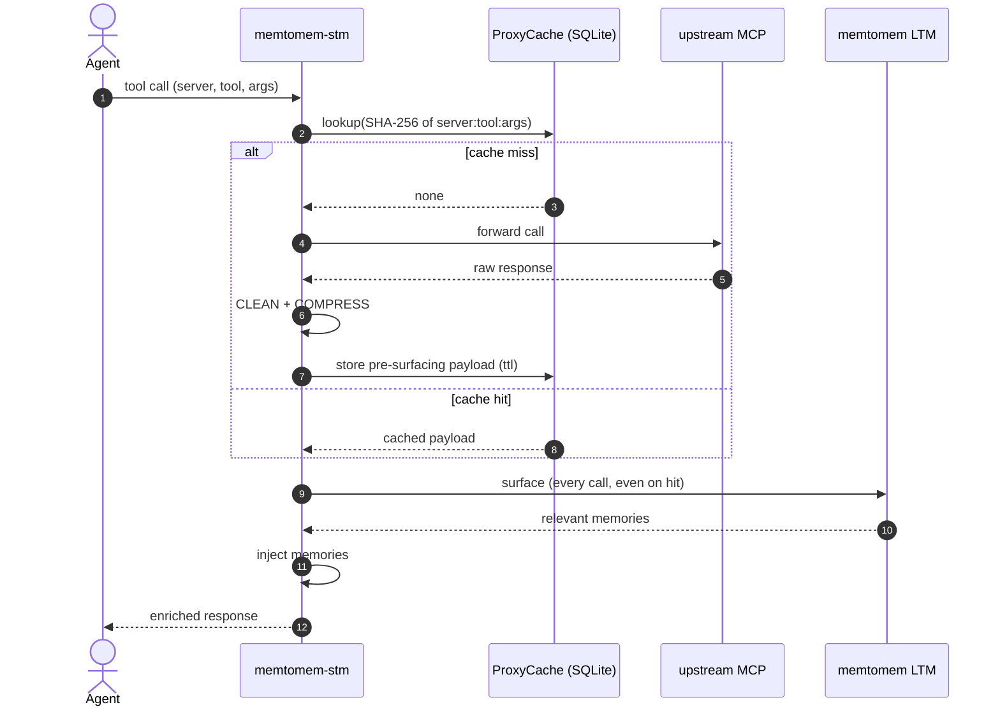
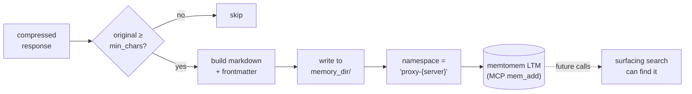

# Response Caching & Auto-Indexing

## Response Cache

Proxied tool responses are cached in SQLite to avoid repeated upstream calls:



The key insight: **the cache stores pre-surfacing content**. Surfacing runs on every cache hit so injected memories stay fresh even when the upstream payload was cached hours ago.

```json
{
  "cache": {
    "enabled": true,
    "db_path": "~/.memtomem/proxy_cache.db",
    "default_ttl_seconds": 3600,
    "max_entries": 10000
  }
}
```

Key details:

- Cache key = SHA-256 of `server:tool:args` (argument order independent)
- **Pre-surfacing content is cached** — surfacing is re-applied on cache hit, so memories stay fresh
- Expired entries are purged on startup; oldest entries evicted when `max_entries` is exceeded
- Clear cache via MCP tool: `stm_proxy_cache_clear(server="gh", tool="search_code")`
- TTL can be overridden per-tool via `tool_overrides`

## Auto-Indexing

When enabled, large tool responses are automatically saved to memtomem LTM for future retrieval:




```json
{
  "auto_index": {
    "enabled": true,
    "min_chars": 2000,
    "memory_dir": "~/.memtomem/proxy_index",
    "namespace": "proxy-{server}"
  }
}
```

Each indexed response creates a markdown file with frontmatter:

```markdown
---
source: proxy/github/search_code
timestamp: 2026-04-05T12:00:00+00:00
compression: hybrid
original_chars: 50000
compressed_chars: 8000
---

# Proxy Response: github/search_code

- **Source**: `github/search_code(query="auth middleware")`
- **Original size**: 50000 chars

## Content

(compressed response content)
```

The namespace supports `{server}` and `{tool}` placeholders. Can be toggled per-server via `auto_index: true|false` in `UpstreamServerConfig`.

> **Note:** Auto-indexing requires a `FileIndexer` wired into
> `ProxyManager`.  The default deployment does not wire one — see
> [Custom Integration](custom-integration.md) for the protocol,
> wiring instructions, and known caveats.
