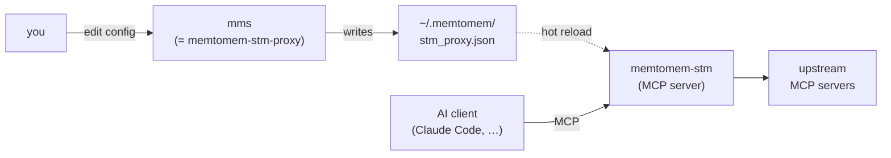
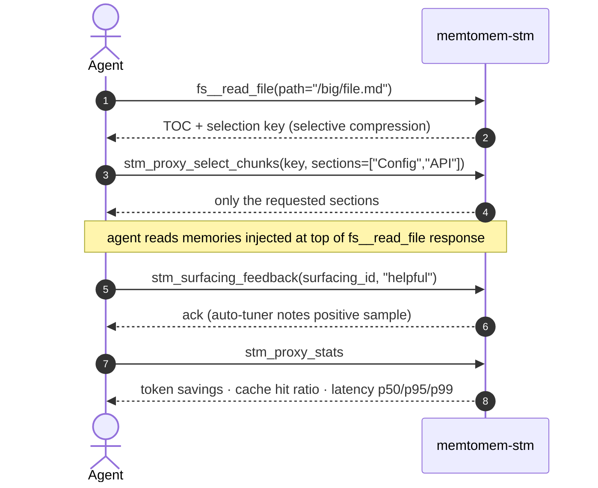

# CLI Reference

memtomem-stm ships three console scripts:

| Script | Purpose |
|--------|---------|
| `memtomem-stm` | The MCP server itself. Add this to your AI client's MCP config. |
| `memtomem-stm-proxy` | Management CLI for editing `~/.memtomem/stm_proxy.json`. |
| `mms` | Short alias for `memtomem-stm-proxy` — identical behavior. |



The `mms` short form pairs with memtomem core's `mm` CLI: `mm` for long-term memory, `mms` for the STM proxy. Use whichever name you prefer; the docs below use `mms` for brevity.

## `mms` (= `memtomem-stm-proxy`)

```
Usage: mms [OPTIONS] COMMAND [ARGS]...

  memtomem-stm proxy gateway management.

Commands:
  add     Add an upstream MCP server to the proxy configuration.
  list    List configured upstream servers.
  remove  Remove an upstream MCP server from the proxy configuration.
  status  Show proxy gateway configuration and server list.
```

All commands accept `--config TEXT` (default `~/.memtomem/stm_proxy.json`).

### `add`

```
Usage: mms add [OPTIONS] NAME

Options:
  --command TEXT                  Executable command (stdio).
  --args TEXT                     Space-separated arguments.
  --prefix TEXT                   Tool name prefix (e.g. 'fs').  [required]
  --transport [stdio|sse|streamable_http]
                                  [default: stdio]
  --url TEXT                      Endpoint URL (SSE / HTTP).
  --env KEY=VALUE
  --compression [auto|none|truncate|selective|hybrid]
                                  [default: auto]
  --max-chars INTEGER             [default: 8000]
```

> **Note**: The CLI's `--compression` flag exposes 5 of the 10 strategies. The remaining five (`extract_fields`, `schema_pruning`, `skeleton`, `progressive`, `llm_summary`) are configured by editing `stm_proxy.json` directly. See [Compression Strategies](compression.md).

### Examples

```bash
# Filesystem server
mms add filesystem \
  --command npx \
  --args "-y @modelcontextprotocol/server-filesystem /home/user/projects" \
  --prefix fs

# GitHub server with env var
mms add github \
  --command npx \
  --args "-y @modelcontextprotocol/server-github" \
  --prefix gh \
  --env GITHUB_TOKEN=ghp_xxx

# SSE transport
mms add docs \
  --transport sse \
  --url https://docs.example.com/mcp \
  --prefix docs

# List configured upstreams
mms list

# Show full status
mms status

# Remove a server
mms remove github
```

## MCP Tools (10 + proxied)

These are exposed by the `memtomem-stm` MCP server and become available to your agent once it's connected.

| Tool | Arguments | Description |
|------|-----------|-------------|
| `stm_proxy_stats` | — | Token savings, compression stats, cache hit/miss ratio |
| `stm_proxy_select_chunks` | `key`, `sections[]` | Retrieve sections from a selective/hybrid TOC response |
| `stm_proxy_read_more` | `key`, `offset`, `limit?` | Read next chunk from a progressive delivery response |
| `stm_proxy_cache_clear` | `server?`, `tool?` | Clear response cache (all, by server, by tool, or by server+tool) |
| `stm_proxy_health` | — | Upstream server connectivity and circuit breaker status |
| `stm_surfacing_feedback` | `surfacing_id`, `rating`, `memory_id?` | Rate surfaced memories (`helpful` / `not_relevant` / `already_known`) |
| `stm_surfacing_stats` | `tool?` | Surfacing event counts, feedback breakdown, helpfulness % |
| `stm_compression_feedback` | `server`, `tool`, `missing`, `kind?`, `trace_id?` | Report missing info from a compressed response (learning signal) |
| `stm_compression_stats` | `tool?` | Compression feedback counts by kind and tool |
| `stm_tuning_recommendations` | `since_hours?`, `tool?` | Per-tool compression tuning recommendations from the auto-tuner |

Plus all proxied tools named `{prefix}__{original_tool_name}` (e.g. `fs__read_file`, `gh__search_repositories`).

A typical agent session uses a mix of proxied tools and STM-specific control tools:



## Logging

Log level is controlled via environment variable (no CLI flag):

```bash
export MEMTOMEM_STM_LOG_LEVEL=DEBUG   # DEBUG | INFO | WARNING | ERROR | CRITICAL
```

See [Configuration → General](configuration.md#general) and
[Operations → Logging](operations.md#logging) for details.
