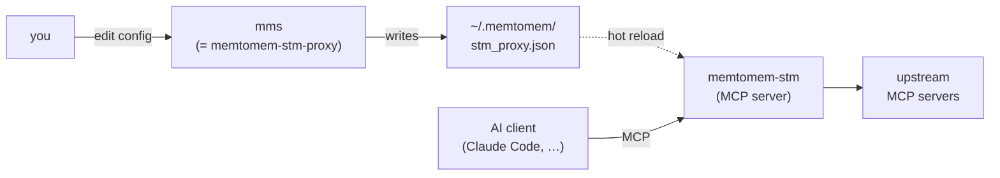
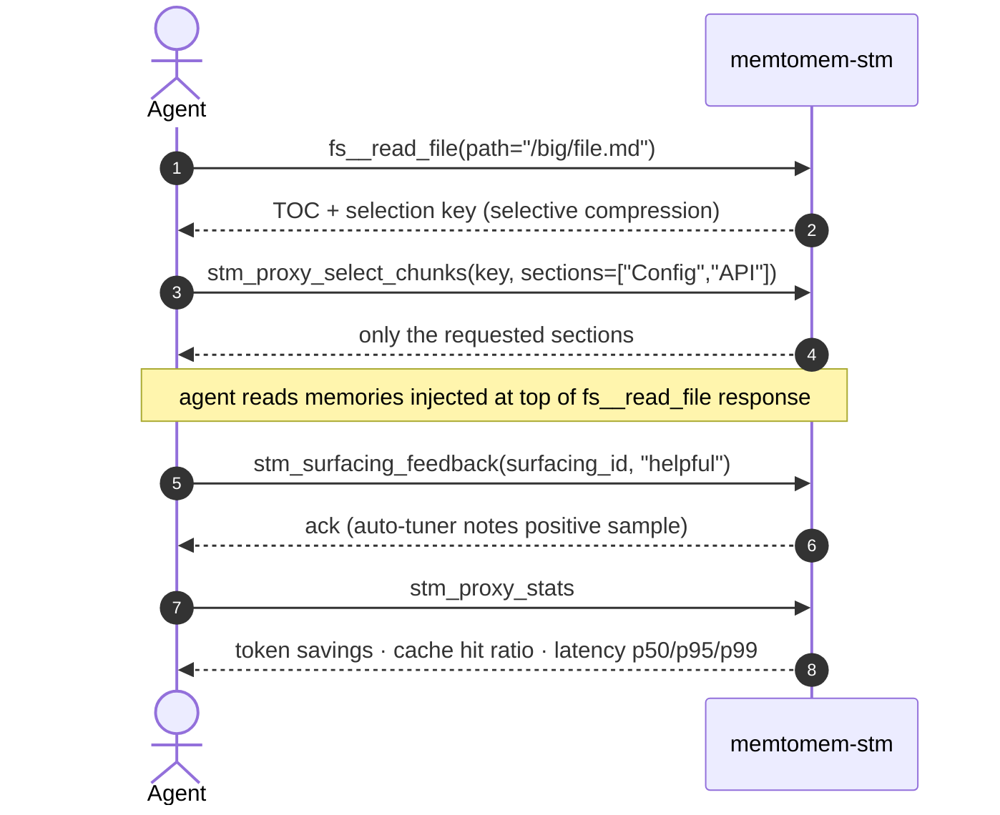

# CLI Reference

memtomem-stm ships three console scripts:

| Script | Purpose |
|--------|---------|
| `memtomem-stm` | The MCP server itself. Add this to your AI client's MCP config. |
| `memtomem-stm-proxy` | Management CLI for editing `~/.memtomem/stm_proxy.json`. |
| `mms` | Short alias for `memtomem-stm-proxy` — identical behavior. |



The `mms` short form pairs with memtomem core's `mm` CLI: `mm` for long-term memory, `mms` for the STM proxy. Use whichever name you prefer; the docs below use `mms` for brevity.

## `mms` (= `memtomem-stm-proxy`)

```
Usage: mms [OPTIONS] COMMAND [ARGS]...

  memtomem-stm proxy gateway management.

Options:
  --version   Show the version and exit.
  -h, --help  Show this message and exit.

Commands:
  add       Add an upstream MCP server to the proxy configuration.
  health    Check upstream server connectivity.
  init      Guided first-time setup for memtomem-stm.
  list      List configured upstream servers.
  register  Register memtomem-stm with an MCP client.
  remove    Remove an upstream MCP server from the proxy configuration.
  status    Show proxy gateway configuration and server list.
  version   Show the installed memtomem-stm version.
```

All commands accept `--config TEXT` (default `~/.memtomem/stm_proxy.json`).

`mms --version` and `mms version` both print `memtomem-stm X.Y.Z` — the flag is the idiomatic Click form, the subcommand is kept for backwards compatibility.

Output is colorized when writing to a terminal; set `NO_COLOR=1` to disable. JSON output (`--json`) and non-TTY streams (pipes, CI) are never colored.

### `init`

```
Usage: mms init [OPTIONS]

Options:
  --config TEXT             [default: ~/.memtomem/stm_proxy.json]
  --no-validate             Skip the connectivity probe entirely (default:
                            prompt, probe on yes).
  --mcp [claude|json|skip]  Pre-answer the MCP-registration prompt for
                            scripted runs: 'claude' = `claude mcp add`,
                            'json' = write .mcp.json, 'skip' = no
                            registration. Omit the flag for the interactive
                            prompt.
```

Interactive wizard for the first-time setup. Prompts for a single upstream server (name, prefix, transport, command/URL), optionally probes connectivity, writes the config, then offers a 3-way MCP-client registration prompt:

1. **Add to Claude Code** — shells out to `claude mcp add` for you.
2. **Generate `.mcp.json`** — writes a project-scoped snippet in the current directory, then prints per-client paste targets for Cursor, Windsurf, Claude Desktop (OS-appropriate path), and Gemini CLI.
3. **Skip** — prints a manual-registration cheat sheet (`claude mcp add` one-liner plus a generic `mcpServers` JSON stanza) so you can wire it up by hand later.

Use `--mcp claude|json|skip` to pre-answer the prompt from scripts, CI, or any caller where stdin isn't a TTY — interactive callers should omit the flag.

Aborts if the config file already exists — use [`register`](#register) to re-run the registration prompt, [`add`](#add) to register additional servers, or [`list`](#list) to inspect the current state. This makes `init` safe to run without clobbering existing configuration.

Validation is **advisory**: probe failures are reported as warnings but the config is still written. That way a flaky network or a cold upstream doesn't block setup; re-run `mms health` later once things are up.

```bash
mms init                 # interactive wizard
mms init --no-validate   # skip the connectivity probe prompt entirely
mms init --mcp claude    # scripted: auto-register with Claude Code
mms init --mcp skip      # scripted: write config, print paste hints, exit
```

### `register`

```
Usage: mms register [OPTIONS]

Options:
  --config TEXT             Path to the proxy config (must already exist —
                            run `mms init` first).  [default:
                            ~/.memtomem/stm_proxy.json]
  --mcp [claude|json|skip]  Pre-answer the registration prompt for scripted
                            runs: 'claude' = `claude mcp add`, 'json' =
                            write .mcp.json, 'skip' = print manual hints.
                            Omit for the interactive prompt.
```

Re-runs the 3-way MCP-client registration prompt from `init` without re-entering the first-time setup wizard. Use this after `mms init` if you initially picked "skip", or when registering the same STM install with a second client.

Requires that `mms init` has already been run so the config file exists — otherwise exits with an error and a hint. Safe to re-run: pre-checks existing Claude Code registration and defaults to **keep** when already registered (no-op — existing registration is preserved even with `--mcp claude`).

```bash
mms register              # interactive prompt
mms register --mcp json   # scripted: write .mcp.json in CWD, exit
mms register --mcp skip   # scripted: print manual paste hints, exit
```

### `add`

```
Usage: mms add [OPTIONS] [NAME]

Options:
  --config TEXT                   [default: ~/.memtomem/stm_proxy.json]
  --command TEXT                  Executable command (stdio).
  --args TEXT                     Space-separated arguments.
  --prefix TEXT                   Tool namespace (e.g. 'fs' -> tools appear
                                  as fs__read_file). Required unless
                                  --from-clients is used.
  --transport [stdio|sse|streamable_http]
                                  stdio for local processes,
                                  sse/streamable_http for remote.
                                  [default: stdio]
  --url TEXT                      Endpoint URL (SSE / HTTP).
  --env KEY=VALUE
  --compression [auto|none|truncate|selective|hybrid]
                                  'auto' picks strategy per response by
                                  content type.  [default: auto]
  --max-chars INTEGER RANGE       [default: 8000; x>=1]
  --validate                      Probe the server (MCP initialize +
                                  list-tools) before saving; abort on
                                  failure.
  --timeout INTEGER RANGE         Connection timeout (seconds) when
                                  --validate is set.  [default: 10; x>=1]
  --from-clients, --import        Import additional servers interactively
                                  from existing MCP clients (Claude
                                  Desktop / Code, project .mcp.json).
                                  Reuses init's discovery + TUI flow.
                                  Skips candidates already registered.
                                  Incompatible with NAME / --prefix /
                                  --command / --args / --url / --env.
```

Use `--validate` to catch typos and misconfigurations at registration time instead of the next time the proxy starts. Without it `add` only writes the config — bad entries are discovered later via `mms health` or when the proxy fails to spawn.

Use `--from-clients` (alias `--import`) to bulk-pick additional servers from the same MCP clients `mms init` scans: `~/.claude.json`, project `.mcp.json`, and `~/Library/Application Support/Claude/claude_desktop_config.json` (OS-appropriate). This is the post-init equivalent of the `init` discovery step — servers already registered in this config are filtered out by name and by `(transport, command, args)` / `(transport, url)` signature before the selection UI. `--validate` and `--timeout` work on the selected subset.

> **Note**: The CLI's `--compression` flag exposes 5 of the 10 strategies. The remaining five (`extract_fields`, `schema_pruning`, `skeleton`, `progressive`, `llm_summary`) are configured by editing `stm_proxy.json` directly. See [Compression Strategies](compression.md).

### Examples

```bash
# Filesystem server
mms add filesystem \
  --command npx \
  --args "-y @modelcontextprotocol/server-filesystem /home/user/projects" \
  --prefix fs

# GitHub server with env var
mms add github \
  --command npx \
  --args "-y @modelcontextprotocol/server-github" \
  --prefix gh \
  --env GITHUB_TOKEN=ghp_xxx

# SSE transport
mms add docs \
  --transport sse \
  --url https://docs.example.com/mcp \
  --prefix docs

# Validate connectivity at registration time (rejects bad entries up front)
mms add filesystem \
  --command npx \
  --args "-y @modelcontextprotocol/server-filesystem /home/user/projects" \
  --prefix fs \
  --validate

# Bulk-import servers already configured in Claude Desktop / Code / .mcp.json
mms add --import            # or --from-clients; skips anything already registered

# List configured upstreams
mms list
mms list --json            # machine-readable: {config_path, servers}

# Show full status
mms status

# Remove a server
mms remove github

# Check upstream connectivity (probes each server)
mms health
mms health --json          # machine-readable output
mms health --timeout 5     # 5s per-server timeout (default: 10)
```

### `health`

```
Usage: mms health [OPTIONS]

Options:
  --config TEXT            [default: ~/.memtomem/stm_proxy.json]
  --json                   Output as JSON for scripting.
  --timeout INTEGER RANGE  Per-server connection timeout in seconds.
                           [default: 10; x>=1]
```

Connects to each configured upstream server (MCP initialize + list-tools) and reports whether it's reachable and how many tools it exposes. Unlike `stm_proxy_health` (the MCP tool), this command probes servers directly — the proxy does not need to be running.

## MCP Tools (11 + proxied)

These are exposed by the `memtomem-stm` MCP server and become available to your agent once it's connected.

| Tool | Arguments | Description |
|------|-----------|-------------|
| `stm_proxy_stats` | — | Token savings, compression stats, cache hit/miss ratio |
| `stm_proxy_select_chunks` | `key`, `sections[]` | Retrieve sections from a selective/hybrid TOC response |
| `stm_proxy_read_more` | `key`, `offset`, `limit?` | Read next chunk from a progressive delivery response |
| `stm_proxy_cache_clear` | `server?`, `tool?` | Clear response cache (all, by server, by tool, or by server+tool) |
| `stm_proxy_health` | — | Upstream server connectivity and circuit breaker status |
| `stm_surfacing_feedback` | `surfacing_id`, `rating`, `memory_id?` | Rate surfaced memories (`helpful` / `not_relevant` / `already_known`) |
| `stm_surfacing_stats` | `tool?` | Surfacing event counts, feedback breakdown, helpfulness % |
| `stm_compression_feedback` | `server`, `tool`, `missing`, `kind?`, `trace_id?` | Report missing info from a compressed response (learning signal) |
| `stm_compression_stats` | `tool?` | Compression feedback counts by kind and tool |
| `stm_progressive_stats` | `tool?` | Progressive-delivery follow-up rate, coverage, and per-tool breakdown |
| `stm_tuning_recommendations` | `since_hours?`, `tool?` | Per-tool compression tuning recommendations from the auto-tuner |

Plus all proxied tools named `{prefix}__{original_tool_name}` (e.g. `fs__read_file`, `gh__search_repositories`).

A typical agent session uses a mix of proxied tools and STM-specific control tools:



## Logging

Log level is controlled via environment variable (no CLI flag):

```bash
export MEMTOMEM_STM_LOG_LEVEL=DEBUG   # DEBUG | INFO | WARNING | ERROR | CRITICAL
```

See [Configuration → General](configuration.md#general) for details.

## Trimming the advertised MCP tool surface

STM advertises eleven MCP tools by default. Seven are operator-facing
(observability / admin) and accessible through this very CLI; the
remaining four are model-facing (progressive-delivery unlocks and
feedback channels). On clients that eager-load MCP tool schemas
into the model context at session start, the seven observability
tools pay schema tokens for calls the model rarely makes.

Set the following to hide them from MCP (they stay callable via
`mms`):

```bash
export MEMTOMEM_STM_ADVERTISE_OBSERVABILITY_TOOLS=false
```

- **Claude Code**: no effect needed — Claude Code lazy-loads MCP
  tool schemas via `ToolSearch`, so advertised count is
  near-free.
- **OpenAI Codex CLI** and other eager-loading clients: set this
  to `false`, or use the downstream per-server filter if your
  client supports one. For Codex:

  ```toml
  # ~/.codex/config.toml
  [mcp_servers.memtomem-stm]
  disabled_tools = [
    "stm_proxy_stats", "stm_proxy_health", "stm_proxy_cache_clear",
    "stm_surfacing_stats", "stm_compression_stats",
    "stm_progressive_stats", "stm_tuning_recommendations",
  ]
  ```

The STM-side flag is a convenience that keeps the list in one
place; the downstream filter is equivalent at the wire level.
