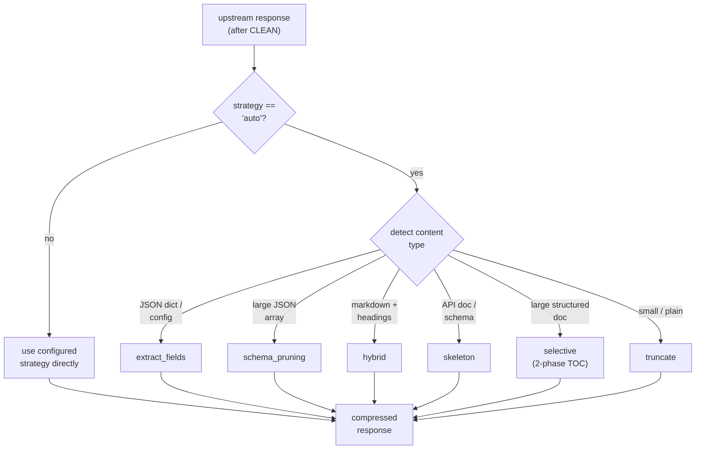
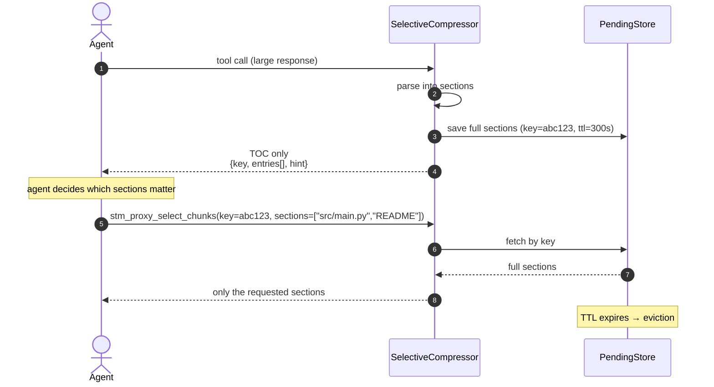
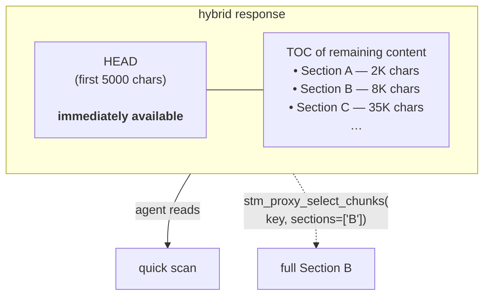
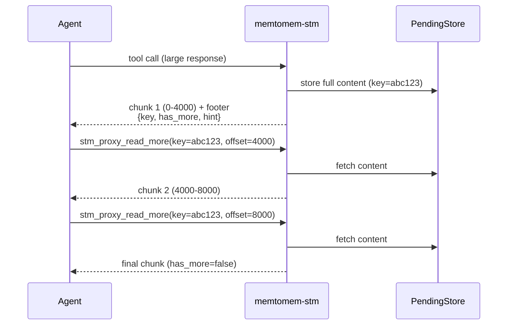

# Compression Strategies

memtomem-stm has 10 compression strategies. The CLI's `--compression` flag exposes 5 of them (`auto`, `none`, `truncate`, `selective`, `hybrid`); the remaining five are selected via the config file. The default is `auto`, which lets `auto_select_strategy()` pick per response.



> **Note**: `progressive` and `llm_summary` are **never** chosen by `auto` — they're opt-in only because they change the agent interaction pattern (progressive needs `stm_proxy_read_more`; `llm_summary` adds external API latency).

| Strategy | Best for | Description |
|----------|----------|-------------|
| **auto** (default) | All responses | Content-aware: picks the best strategy per response based on content type |
| **hybrid** | Large structured docs | Preserves first ~5K chars + TOC for the remainder |
| **selective** | Large structured data | 2-phase: returns TOC only, then retrieve selected sections on demand |
| **truncate** | Simple limiting | Section-aware for markdown (minimum representation for ALL sections, then enriches by relevance); query-aware budget allocation when `_context_query` is provided |
| **extract_fields** | JSON configs | Preserves all top-level keys with nested structure + first values |
| **schema_pruning** | Large JSON arrays | Recursive pruning: first 2 + last 1 items sampled per array |
| **skeleton** | API docs | All headings + first content line per section |
| **progressive** | Large any-type content | Zero information loss: stores full content, delivers in chunks on demand via `stm_proxy_read_more` |
| **llm_summary** | High-value content | Calls an external LLM (OpenAI / Anthropic / Ollama) to summarize |
| **none** | Passthrough | No compression (cache only) |

## Selective Compression (2-phase)

**Phase 1** — STM parses the response into sections and returns a compact TOC:

```json
{
  "type": "toc",
  "selection_key": "abc123def456",
  "format": "json",
  "total_chars": 50000,
  "entries": [
    {"key": "README", "type": "heading", "size": 200, "preview": "..."},
    {"key": "src/main.py", "type": "heading", "size": 5000, "preview": "..."}
  ],
  "hint": "Call stm_proxy_select_chunks(key='abc123def456', sections=[...]) to retrieve."
}
```

**Phase 2** — Agent calls `stm_proxy_select_chunks` to retrieve only the sections it needs.



Auto-detects format: JSON dicts (parsed by keys), JSON arrays (parsed by index), Markdown (parsed by headings), plain text (parsed by paragraphs).

Pending selections are stored for 5 minutes (max 100 concurrent), then auto-evicted. For multi-instance deployments, switch to SQLite-backed pending storage — see [Operations → Horizontal Scaling](operations.md#horizontal-scaling).

## Hybrid Compression

Combines immediate access with selective retrieval:



Configurable per server:

```json
{
  "hybrid": {
    "head_chars": 5000,
    "tail_mode": "toc",
    "head_ratio": 0.6,
    "min_toc_budget": 200
  }
}
```

## Progressive Delivery (cursor-based)

Inspired by how Claude Code reads files progressively (150 lines at a time), progressive delivery stores the full cleaned content and delivers it in chunks on demand — **zero information loss**.



The first chunk includes a metadata footer with remaining headings/structure hints so the agent can decide whether to continue reading.

| Feature | Selective | Progressive |
|---------|-----------|-------------|
| Access pattern | By name (random) | By offset (sequential) |
| Requires structure | Yes (headings/JSON keys) | No (any content) |
| Information loss | None (section-level) | None (full content) |
| Use case | "Show me the Config section" | "Read through this file" |

```json
{
  "compression": "progressive",
  "progressive": {
    "chunk_size": 4000,
    "max_stored": 200,
    "ttl_seconds": 600,
    "include_structure_hint": true
  }
}
```

Progressive is **opt-in only** — `auto` strategy never selects it because it changes the agent interaction pattern (requires calling `stm_proxy_read_more`).

> **Note**: Memory surfacing (Stage 3) is **skipped** for progressive delivery responses. Injecting memories into the first chunk would shift character offsets for subsequent `stm_proxy_read_more` calls.

## LLM Compression

Routes through an external LLM for intelligent summarization:

```json
{
  "llm": {
    "provider": "openai",
    "model": "gpt-4o-mini",
    "api_key": "sk-...",
    "max_tokens": 500,
    "system_prompt": "Summarize concisely, preserving key information. Under {max_chars} chars."
  }
}
```

Providers: `openai`, `anthropic`, `ollama`. Falls back to truncation on API failure (circuit breaker protection — see [Operations → Safety & Resilience](operations.md#safety--resilience)).

Sensitive content (API keys, passwords, PII) is auto-detected and **never** sent to external LLMs — falls back to local truncation. See [Operations → Privacy](operations.md#privacy) for the patterns.

## Query-Aware Compression

When an agent provides `_context_query` in tool arguments, compression allocates budget proportionally to section relevance instead of fixed top-down order. This preserves more information from query-relevant sections.

```json
{
  "relevance_scorer": {
    "scorer": "bm25",
    "embedding_provider": "ollama",
    "embedding_model": "nomic-embed-text",
    "embedding_base_url": "http://localhost:11434",
    "embedding_timeout": 10.0
  }
}
```

| Scorer | Latency | Cross-language | Dependencies |
|--------|---------|----------------|--------------|
| `bm25` (default) | <1ms | No | None |
| `embedding` | 5-50ms | Yes | Ollama / OpenAI |

`RelevanceScorer` protocol (`proxy/relevance.py`) enables custom scorer implementations. `EmbeddingScorer` uses sync httpx to call embedding APIs with automatic BM25 fallback on error.

## Per-Server and Per-Tool Overrides

```json
{
  "upstream_servers": {
    "github": {
      "prefix": "gh",
      "compression": "hybrid",
      "max_result_chars": 16000,
      "tool_overrides": {
        "search_code": {
          "compression": "selective",
          "max_result_chars": 8000
        },
        "get_file_contents": {
          "compression": "none"
        }
      }
    }
  }
}
```

## Model-Aware Defaults

When `consumer_model` is set, STM automatically scales settings for the consuming model's context window. Set it once and the compression budget, surfacing injection size, and result count all adjust.

```bash
export MEMTOMEM_STM_PROXY__CONSUMER_MODEL=claude-sonnet-4
```

| Setting | SLM (≤32K) | Medium (32K-200K) | LLM (>200K) |
|---------|------------|-------------------|--------------|
| `max_result_chars` | ~5,600 | ~16,000 | ~35,000 |
| `max_injection_chars` | 1,500 | 3,000 | 5,000 |
| `max_results` (surfacing) | 2 | 3 | 5 |
| `context_window` | 0-1 | 1-2 | 2-5 |
| Compression strategy | skeleton / truncate | auto (default) | auto / none |

### Model Examples

| Model | Context | Tier | Notes |
|-------|---------|------|-------|
| `o1-mini` | 128K | Medium | Default settings work well |
| `gpt-4o` | 128K | Medium | Default settings work well |
| `gpt-4.1` | 1M | LLM | Generous budget, more surfacing |
| `gpt-4.1-mini` | 1M | LLM | Generous budget, more surfacing |
| `claude-sonnet-4` | 200K | Medium | Default settings work well |
| `claude-opus-4` | 200K | Medium | Default settings work well |
| `o3` / `o4-mini` | 200K | Medium | Reasoning models, default settings |
| `gemini-2.5-pro` | 1M | LLM | Generous budget, more surfacing |
| `llama-4-scout` | 512K | LLM | Open-weight, generous budget |
| `deepseek-r1` | 131K | Medium | Default settings work well |
| `qwen-3` | 131K | Medium | Default settings work well |

All scaling is automatic when `consumer_model` is set. Override any value explicitly to disable auto-scaling for that setting.
