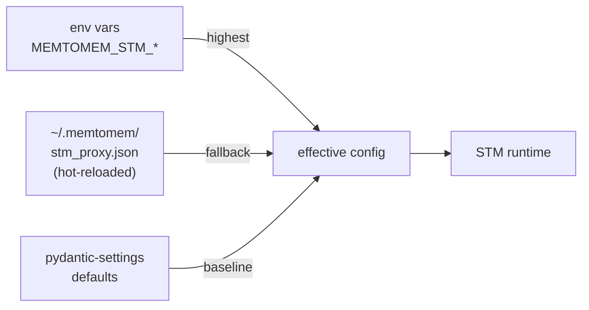

# Configuration Reference

memtomem-stm reads configuration from two sources, in order of precedence:



1. **Environment variables** — prefix `MEMTOMEM_STM_`, double-underscore (`__`) for nesting
2. **Config file** — `~/.memtomem/stm_proxy.json` (hot-reloaded; changes take effect on the next tool call without restarting)
3. **Defaults** — every setting has a sensible default in pydantic-settings, so you can run STM with zero configuration

For most quick-start scenarios you can ignore the config file entirely and use the [CLI](cli.md) (`mms add ...`) plus a few env vars.

## Environment Variables

All settings use the `MEMTOMEM_STM_` prefix with `__` for nesting.

### General

```bash
export MEMTOMEM_STM_LOG_LEVEL=WARNING   # DEBUG | INFO | WARNING | ERROR | CRITICAL
```

Controls `logging.basicConfig()` level for all `memtomem_stm.*`
loggers.  Default `WARNING`.  Read once at startup — restart to
apply changes.

### Proxy

```bash
export MEMTOMEM_STM_PROXY__ENABLED=true
export MEMTOMEM_STM_PROXY__DEFAULT_COMPRESSION=auto
export MEMTOMEM_STM_PROXY__DEFAULT_MAX_RESULT_CHARS=16000
export MEMTOMEM_STM_PROXY__MAX_UPSTREAM_CHARS=10000000   # OOM guard before compression
export MEMTOMEM_STM_PROXY__MIN_RESULT_RETENTION=0.65
export MEMTOMEM_STM_PROXY__CONSUMER_MODEL=claude-sonnet-4
export MEMTOMEM_STM_PROXY__CONTEXT_BUDGET_RATIO=0.05
export MEMTOMEM_STM_PROXY__MAX_DESCRIPTION_CHARS=200
export MEMTOMEM_STM_PROXY__STRIP_SCHEMA_DESCRIPTIONS=false
export MEMTOMEM_STM_PROXY__CACHE__ENABLED=true
export MEMTOMEM_STM_PROXY__CACHE__DEFAULT_TTL_SECONDS=3600
export MEMTOMEM_STM_PROXY__CACHE__DB_PATH=~/.memtomem/proxy_cache.db
export MEMTOMEM_STM_PROXY__CACHE__MAX_ENTRIES=10000
export MEMTOMEM_STM_PROXY__METRICS__ENABLED=true
export MEMTOMEM_STM_PROXY__METRICS__DB_PATH=~/.memtomem/proxy_metrics.db
export MEMTOMEM_STM_PROXY__METRICS__MAX_HISTORY=10000

# Auto-indexing (Stage 4 — save large responses to LTM)
export MEMTOMEM_STM_PROXY__AUTO_INDEX__ENABLED=false
export MEMTOMEM_STM_PROXY__AUTO_INDEX__MIN_CHARS=2000
export MEMTOMEM_STM_PROXY__AUTO_INDEX__MEMORY_DIR=~/.memtomem/proxy_index
export MEMTOMEM_STM_PROXY__AUTO_INDEX__NAMESPACE=proxy-{server}

# Relevance scorer (query-aware compression)
export MEMTOMEM_STM_PROXY__RELEVANCE_SCORER__SCORER=bm25           # "bm25" or "embedding"
export MEMTOMEM_STM_PROXY__RELEVANCE_SCORER__EMBEDDING_PROVIDER=ollama
export MEMTOMEM_STM_PROXY__RELEVANCE_SCORER__EMBEDDING_MODEL=nomic-embed-text
export MEMTOMEM_STM_PROXY__RELEVANCE_SCORER__EMBEDDING_BASE_URL=http://localhost:11434

# Required when embedding_provider="openai" — the scorer reads this from the
# environment and falls back to BM25 with an HTTP 401 if missing.
export OPENAI_API_KEY=sk-...

# Compression feedback (learning signal for auto-tuner)
export MEMTOMEM_STM_PROXY__COMPRESSION_FEEDBACK__ENABLED=true
export MEMTOMEM_STM_PROXY__COMPRESSION_FEEDBACK__DB_PATH=~/.memtomem/stm_feedback.db
```

### Surfacing

```bash
export MEMTOMEM_STM_SURFACING__ENABLED=true
export MEMTOMEM_STM_SURFACING__MIN_SCORE=0.02
export MEMTOMEM_STM_SURFACING__MAX_RESULTS=3
export MEMTOMEM_STM_SURFACING__MIN_RESPONSE_CHARS=5000
export MEMTOMEM_STM_SURFACING__FEEDBACK_ENABLED=true
export MEMTOMEM_STM_SURFACING__AUTO_TUNE_ENABLED=true
export MEMTOMEM_STM_SURFACING__CONTEXT_WINDOW_SIZE=0       # 0=disabled; >0 expands ±N adjacent chunks
export MEMTOMEM_STM_SURFACING__CONSUMER_MODEL=claude-sonnet-4  # auto-scales max_results + max_injection_chars
export MEMTOMEM_STM_SURFACING__DEDUP_TTL_SECONDS=604800    # 7 days; 0 to disable cross-session dedup
export MEMTOMEM_STM_SURFACING__FEEDBACK_DB_PATH=~/.memtomem/stm_feedback.db

# LTM connection (defaults shown)
export MEMTOMEM_STM_SURFACING__LTM_MCP_COMMAND=memtomem-server
export MEMTOMEM_STM_SURFACING__LTM_MCP_ARGS='["--config","/etc/memtomem.json"]'
```

See [Surfacing → Surfacing Controls](surfacing.md#surfacing-controls) for the complete table of fields and defaults.

### Langfuse Tracing (optional)

```bash
pip install "memtomem-stm[langfuse]"
# or with uv:
uv pip install "memtomem-stm[langfuse]"

export MEMTOMEM_STM_LANGFUSE__ENABLED=true
export MEMTOMEM_STM_LANGFUSE__PUBLIC_KEY=pk-lf-...
export MEMTOMEM_STM_LANGFUSE__SECRET_KEY=sk-lf-...
export MEMTOMEM_STM_LANGFUSE__HOST=https://cloud.langfuse.com   # or http://localhost:3000 for self-hosted
export MEMTOMEM_STM_LANGFUSE__SAMPLING_RATE=1.0                # 0.0–1.0, fraction of calls to trace
```

When enabled, every proxy tool invocation is wrapped in a `proxy_call` Langfuse observation with nested sub-spans for each pipeline stage (clean, compress, surface, index).

## Config File: `~/.memtomem/stm_proxy.json`

Full example with all options:

```json
{
  "enabled": true,
  "default_max_result_chars": 16000,
  "min_result_retention": 0.65,
  "consumer_model": "",
  "context_budget_ratio": 0.05,
  "max_description_chars": 200,
  "strip_schema_descriptions": false,
  "upstream_servers": {
    "filesystem": {
      "command": "npx",
      "args": ["-y", "@modelcontextprotocol/server-filesystem", "/home/user"],
      "prefix": "fs",
      "transport": "stdio",
      "compression": "auto",
      "max_result_chars": 8000,
      "retention_floor": null,
      "max_retries": 3,
      "reconnect_delay_seconds": 1.0,
      "max_reconnect_delay_seconds": 30.0,
      "max_description_chars": 200,
      "strip_schema_descriptions": false,
      "cleaning": {
        "strip_html": true,
        "deduplicate": true,
        "collapse_links": true
      },
      "selective": {
        "max_pending": 100,
        "pending_ttl_seconds": 300,
        "pending_store": "memory",
        "pending_store_path": "~/.memtomem/pending_selections.db"
      },
      "hybrid": {
        "head_chars": 5000,
        "tail_mode": "toc",
        "head_ratio": 0.6
      },
      "progressive": {
        "chunk_size": 4000,
        "max_stored": 200,
        "ttl_seconds": 1800
      },
      "tool_overrides": {
        "read_file": {
          "compression": "progressive",
          "retention_floor": 0.5
        },
        "internal_debug": {
          "hidden": true
        }
      }
    },
    "github": {
      "command": "npx",
      "args": ["-y", "@modelcontextprotocol/server-github"],
      "prefix": "gh",
      "env": { "GITHUB_TOKEN": "ghp_xxx" },
      "compression": "auto",
      "max_result_chars": 16000,
      "auto_index": true,
      "tool_overrides": {
        "search_code": {
          "compression": "selective",
          "max_result_chars": 8000
        }
      }
    }
  },
  "cache": {
    "enabled": true,
    "db_path": "~/.memtomem/proxy_cache.db",
    "default_ttl_seconds": 3600,
    "max_entries": 10000
  },
  "auto_index": {
    "enabled": false,
    "background": false,
    "min_chars": 2000,
    "memory_dir": "~/.memtomem/proxy_index",
    "namespace": "proxy-{server}"
  },
  "relevance_scorer": {
    "scorer": "bm25",
    "embedding_provider": "ollama",
    "embedding_model": "nomic-embed-text",
    "embedding_base_url": null,
    "embedding_timeout": 10.0
  },
  "metrics": {
    "enabled": true,
    "max_history": 10000
  },
  "compression_feedback": {
    "enabled": true,
    "db_path": "~/.memtomem/stm_feedback.db"
  }
}
```

The config file is **hot-reloaded** — changes take effect on the next tool call without restarting STM. Adding or removing upstream servers still requires a server restart because transport connections are established once at startup.

| Setting group | Hot-reload? | Notes |
|---------------|-------------|-------|
| Per-server compression, cleaning, `tool_overrides` | Yes | `compression`, `max_result_chars`, `retention_floor`, `cleaning.*`, `tool_overrides.*` take effect on the next tool call |
| `relevance_scorer.*` | Yes | All five fields (`scorer`, `embedding_provider`, `embedding_model`, `embedding_base_url`, `embedding_timeout`). A change in any field rebuilds the scorer instance in place. |
| `llm.*` compressor config | Yes | Changing any field closes the old `LLMCompressor` and constructs a new one lazily on the next tool call. |
| Adding / removing upstream servers | **No** (restart) | Transport connections are established once at startup. |

Omitting `embedding_base_url` (or setting it to `null`) lets provider-aware defaults fill it in — `ollama → http://localhost:11434`, `openai → https://api.openai.com`.

```mermaid
sequenceDiagram
    autonumber
    actor User
    participant CLI as mms
    participant File as stm_proxy.json
    participant Watcher as ConfigWatcher
    participant STM as proxy runtime
    actor Agent

    User->>CLI: mms add github --prefix gh ...
    CLI->>File: write new server entry
    Watcher-)Watcher: detect mtime change
    Watcher->>STM: reload()
    Note over STM: new ToolConfig built;<br/>existing in-flight call unaffected
    Agent->>STM: next proxied call
    STM-->>Agent: served with new config
```

## Transport Types

| Transport | Config fields | Description |
|-----------|---------------|-------------|
| `stdio` (default) | `command`, `args`, `env` | Standard subprocess MCP server |
| `sse` | `url`, `headers` | Server-Sent Events over HTTP |
| `streamable_http` | `url`, `headers` | HTTP streamable responses |
