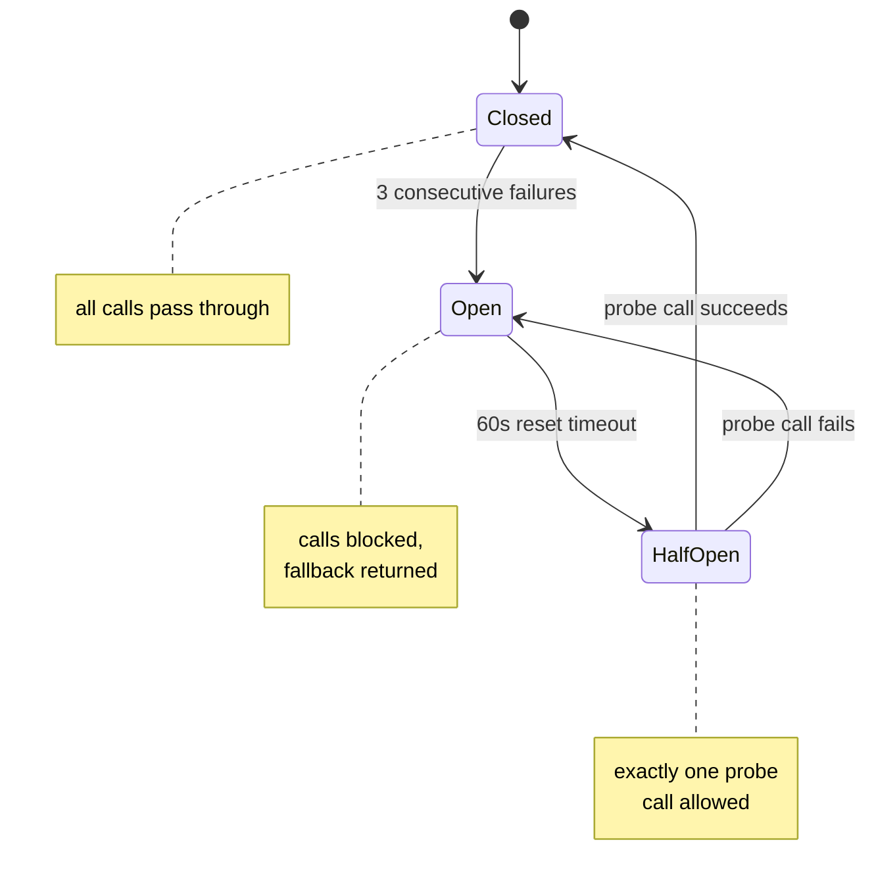
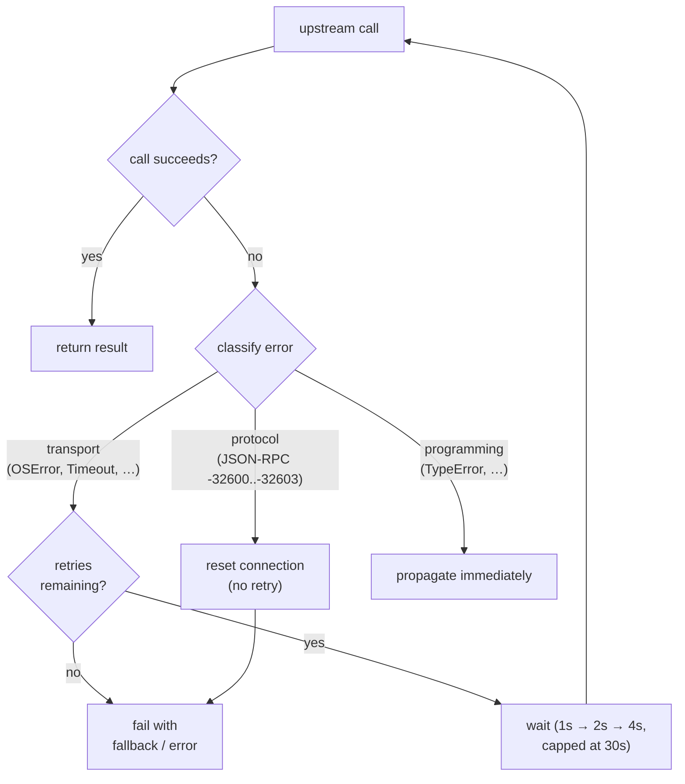
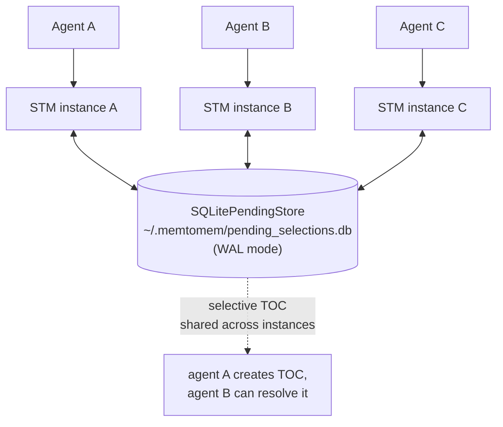
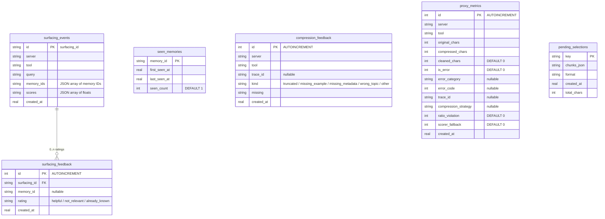

# Operations

Reference for running memtomem-stm in production: safety, privacy, scaling, observability, and on-disk state.

## Safety & Resilience

### Circuit Breaker

A unified 3-state circuit breaker protects against cascading failures:



- **Closed**: all calls pass through normally
- **Open**: all surfacing/LLM calls blocked (falls back to original response or truncation)
- **Half-open**: allows exactly one probe call after timeout; success closes, failure re-opens

Applied to both surfacing (LTM search) and LLM compression (external API calls).

### Connection Recovery



- **Retry with backoff** — transport errors retried up to `max_retries` (default 3) with exponential backoff (1s → 2s → 4s → max 30s)
- **Protocol error isolation** — JSON-RPC errors (-32600 to -32603) are not retried; the connection is reset for the next call
- **Error type filtering** — only transport errors (`OSError`, `ConnectionError`, `TimeoutError`, `EOFError`) and MCP errors trigger retry. Programming errors (`TypeError`, `AttributeError`) propagate immediately.

### Other Protections

- **Timeout** — 3s surfacing timeout, falls back to original compressed response
- **Rate limiting** — max 15 surfacings per minute (sliding window)
- **Write-tool skip** — never surfaces for `*write*`, `*create*`, `*delete*`, `*push*`, `*send*`, `*remove*` tools
- **Query cooldown** — deduplicates similar queries (Jaccard similarity > 0.95) within a 5s window
- **Response size gate** — skips surfacing for responses under `min_response_chars` (default 5000)
- **Session dedup** — same memory ID not shown twice in one session
- **Cross-session dedup** — recently surfaced memory IDs persisted to SQLite; not re-surfaced within `dedup_ttl_seconds` (default 7 days). Set to `0` to disable.
- **Injection size cap** — memory block truncated if total exceeds `max_injection_chars` (default 3000)
- **Boost guard** — each surfacing event can only boost `access_count` once (duplicate feedback ignored)
- **Fresh cache** — proxy cache stores pre-surfacing content; surfacing is re-applied on cache hit so memories stay current

## Shutdown & Lifecycle

When STM is run as the packaged CLI (`mms serve` / `memtomem-stm-proxy`), the shutdown sequence is handled for you: signals cascade into `ProxyManager.stop()` and `SurfacingEngine.stop()`, which drain background tasks and close any held HTTP clients. Integrators embedding STM inside a long-lived application need to call these explicitly.

```python
from memtomem_stm.proxy.manager import ProxyManager
from memtomem_stm.surfacing.engine import SurfacingEngine

# ... run STM inside your app ...

await surfacing_engine.stop()   # cancels & drains webhook tasks
await proxy_manager.stop()      # drains background extraction,
                                # closes LLMCompressor / extractor httpx clients,
                                # closes per-upstream MCP connection stacks
```

| Shutdown step | What it cleans up |
|---------------|-------------------|
| `SurfacingEngine.stop()` | Cancels and awaits outstanding webhook tasks (fired via `asyncio.create_task`). Safe to call multiple times. |
| `ProxyManager.stop()` | Cancels background extraction tasks, calls `LLMCompressor.close()` and `Extractor.close()` to release each `httpx.AsyncClient`, and `aclose()`s every `AsyncExitStack` that owns an upstream MCP connection. |
| `LLMCompressor.close()` | Closes the held `httpx.AsyncClient` and sets it to `None` so the instance is safe to discard. Normally called via `ProxyManager.stop()`; call it directly only if you constructed `LLMCompressor` standalone (e.g. for tests or hot-reload replacement). |

**Ordering.** Stop surfacing first so webhook tasks do not race against a half-closed proxy. Then stop the proxy manager, which is responsible for closing compressor/extractor HTTP clients and upstream connections. Inverting the order leaks an `httpx.AsyncClient` if a webhook task is mid-flight.

**Hot-reload / replacement.** When swapping `LLMCompressor` or the relevance scorer at runtime (e.g. because config changed), `await old.close()` before discarding the reference so the old `httpx.AsyncClient` is drained. `ProxyManager` already does this for `LLMCompressor` via its config-reload path; the relevance scorer holds no `httpx.AsyncClient` (sync `httpx` per call) and is simply replaced in place.

## Privacy

Sensitive content is auto-detected and never sent to external LLM compression:

| Pattern | Example |
|---------|---------|
| API keys / tokens | `api_key=...`, `sk-xxxx`, `ghp_xxxx`, `xoxb-...` |
| Passwords | `password=...`, `passwd: ...`, `pwd=...` |
| Email addresses | `user@example.com` |
| Private keys | `BEGIN RSA PRIVATE KEY`, `BEGIN EC PRIVATE KEY`, `BEGIN OPENSSH PRIVATE KEY` |

Detection scans the first 10K characters. When sensitive content is found, LLM compression falls back to local truncation.

## Horizontal Scaling

By default, `SelectiveCompressor` stores pending TOC selections in memory. For multi-instance deployments, switch to SQLite-backed storage so instances share state:




```json
{
  "upstream_servers": {
    "filesystem": {
      "selective": {
        "pending_store": "sqlite",
        "pending_store_path": "~/.memtomem/pending_selections.db"
      }
    }
  }
}
```

| Backend | Config value | Use case |
|---------|-------------|----------|
| `memory` (default) | In-process dict + deque | Single instance, zero overhead |
| `sqlite` | SQLite with WAL mode | Multiple instances sharing TOC state |

With `sqlite`, instance A can create a TOC and instance B can `stm_proxy_select_chunks` to retrieve sections from that TOC.

## Observability

### Metrics

Token savings, error rates, and latency tracked per server and tool. Example output of `stm_proxy_stats`:

```
STM Proxy Stats
===============
Total calls:     247
Original chars:  1234567
Compressed:      345678
Savings:         72.0%
Cache hits:      89
Cache misses:    158

By server:
  filesystem: 142 calls, 800000 → 200000 chars (75.0% saved)
  github: 105 calls, 434567 → 145678 chars (66.6% saved)

Surfacing: enabled (min_score=0.02)
```

- **Error classification** — errors are categorized as `transport`, `timeout`, `protocol`, `upstream_error`, or `programming`. Each failed call records the category and code for debugging.
- **Trace IDs** — every proxy call generates a unique `trace_id` (16-char hex) for correlating logs and metrics.

Metrics are persisted to SQLite (`~/.memtomem/proxy_metrics.db`, max 10K entries) with error category and trace_id columns.

### Langfuse Tracing (optional)

```bash
pip install "memtomem-stm[langfuse]"
# or with uv:
uv pip install "memtomem-stm[langfuse]"

export MEMTOMEM_STM_LANGFUSE__ENABLED=true
export MEMTOMEM_STM_LANGFUSE__PUBLIC_KEY=pk-lf-...
export MEMTOMEM_STM_LANGFUSE__SECRET_KEY=sk-lf-...
export MEMTOMEM_STM_LANGFUSE__HOST=https://cloud.langfuse.com   # or http://localhost:3000 for self-hosted
```

**What gets traced.** Every proxy tool invocation is wrapped in a top-level Langfuse observation called **`proxy_call`** with nested sub-spans for each pipeline stage:

| Span name | When | Metadata |
|---|---|---|
| `proxy_call` | Every proxy invocation | `server`, `tool`, `trace_id` |
| `proxy_call_clean` | Stage 1 (content cleaning) | `server`, `tool` |
| `proxy_call_compress` | Stage 2 (compression) | `server`, `tool`, `strategy`, `max_chars` |
| `proxy_call_surface` | Stage 3 (memory injection) | `server`, `tool` |
| `proxy_call_index` | Stage 4 (auto-indexing) | `server`, `tool` |
| `proxy_call_cache_hit` | Cache hit (replaces stages 1-2) | `server`, `tool` |
| `stm_surfacing_feedback` | Surfacing feedback tool call | `surfacing_id`, `rating`, `memory_id` |
| `stm_surfacing_stats` | Surfacing stats query | `tool` |
| `surfacing_feedback_boost` | Access count boost (sub-span of feedback) | `surfacing_id`, `chunk_count` |

The `trace_id` (16-char hex) matches `proxy_metrics.db.trace_id` — join on this to correlate a Langfuse span with its SQLite metrics row. Span durations are auto-recorded from the `with` block. Errors propagate through spans — a failed upstream call shows up with an exception attached.

**Trace context propagation.** When forwarding calls to upstream MCP servers, STM includes a `_trace_id` reserved field in the tool arguments. Upstream servers can extract this to correlate their own spans with the originating STM trace. The same `_trace_id` field is available for `McpClientSearchAdapter.search()`, `increment_access()`, and `scratch_list()` calls to the LTM server.

**Sampling.** For high-throughput deployments, set a sampling rate to reduce Langfuse ingest volume:

```bash
export MEMTOMEM_STM_LANGFUSE__SAMPLING_RATE=0.1  # trace 10% of calls
```

Default is `1.0` (trace all). When a call is sampled out, all sub-spans are skipped. Metrics recording (`proxy_metrics.db`) is never affected by sampling — it always runs.

**Why this is the recommended observability UI.** memtomem-stm intentionally does not ship an in-repo web dashboard — the MCP tools (`stm_proxy_stats`, `stm_surfacing_stats`, `stm_proxy_health`), SQLite metrics (`proxy_metrics.db`, `stm_feedback.db`), and Langfuse together cover the observability surface without duplication. For team deployments that want a shared UI, point every instance at the same Langfuse project. When reporting issues, include the `trace_id` from `stm_proxy_stats` output so it can be located in Langfuse immediately.

**Graceful degradation.** If the `langfuse` optional extra is not installed, or if `MEMTOMEM_STM_LANGFUSE__ENABLED=false` (the default), the trace wrapper collapses to a `nullcontext` — zero overhead, no log spam, no behavior change.

## Data Storage

| File | Purpose | Managed by |
|------|---------|------------|
| `~/.memtomem/stm_proxy.json` | Upstream server config (hot-reloaded) | `mms` CLI |
| `~/.memtomem/proxy_cache.db` | Response cache (SQLite, WAL mode) | ProxyCache |
| `~/.memtomem/proxy_metrics.db` | Compression metrics history | MetricsStore |
| `~/.memtomem/stm_feedback.db` | Surfacing events, feedback ratings & compression feedback | FeedbackStore, CompressionFeedbackStore |
| `~/.memtomem/pending_selections.db` | Shared pending TOC state (horizontal scaling) | SQLitePendingStore |
| `~/.memtomem/proxy_index/*.md` | Auto-indexed responses | auto-index pipeline |



The `surfacing_events`, `surfacing_feedback`, `seen_memories`, and `compression_feedback` tables live in `stm_feedback.db`. `proxy_metrics` lives in `proxy_metrics.db`. `pending_selections` lives in `pending_selections.db` only when the SQLite-backed `PendingStore` is enabled.
