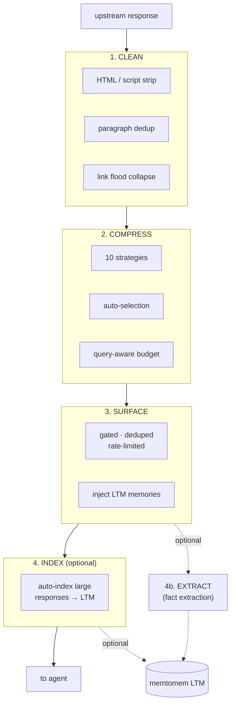
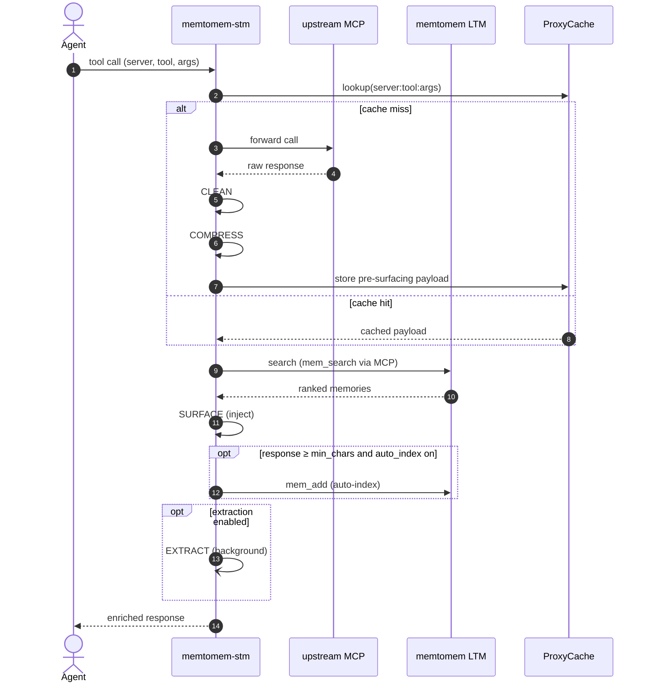

# Pipeline

Every proxied tool call that returns a successful text response goes through 4 stages (plus an optional 4b for fact extraction). Non-text responses (images, binary data) and error responses are passed through without processing.



The CLEAN → COMPRESS → SURFACE → INDEX path is synchronous. The optional **4b EXTRACT** stage runs in parallel via a background extractor that does not block the agent response.



## Tool Naming

All upstream tools are exposed with a `{prefix}__{original_name}` naming convention (e.g. `fs__read_file`). Tool descriptions are prefixed with `[proxied]` to distinguish them from the built-in STM control tools. When a tool's compression strategy changes the agent interaction pattern (selective, progressive, or hybrid with `tail_mode: toc`), a convention suffix is appended to the description — e.g. `| TOC response: use stm_proxy_select_chunks` — so the agent knows which follow-up tool to call.

## Stage 1: CLEAN

Removes noise from the upstream response before compression. Each step can be toggled per server or per tool (via `tool_overrides`) in `stm_proxy.json`:

- **`<script>` / `<style>` removal** — content and tags fully stripped before other processing
- **HTML stripping** — removes tags (preserves code fences and generic types like `List<String>`)
- **Paragraph deduplication** — removes identical paragraphs
- **Link flood collapse** — replaces paragraphs where 80%+ lines are links (10+ lines) with `[N links omitted]`
- **Whitespace normalization** — collapses triple+ newlines to double

```json
{
  "cleaning": {
    "enabled": true,
    "strip_html": true,
    "deduplicate": true,
    "collapse_links": true
  }
}
```

## Stage 2: COMPRESS

Reduces response size to save tokens. See [Compression Strategies](compression.md) for the full reference of all 10 strategies.

## Stage 3: SURFACE

Proactively injects relevant memories from a memtomem LTM server. See [Surfacing](surfacing.md) for the gating, dedup, and feedback details.

Surfacing only activates when the compressed response is at least `min_response_chars` (default 5000). For small responses, surfacing is skipped to avoid negative token savings.

## Stage 4: INDEX (optional)

Automatically indexes large responses to memtomem LTM for future retrieval. See [Caching & Auto-Indexing](caching.md#auto-indexing) for the configuration reference.

## Stage 4b: Auto Fact Extraction (optional)

Automatically extracts discrete facts from tool responses using an LLM. Strategies: `llm` (default, Ollama qwen3:4b with no-think mode), `heuristic`, `hybrid`, `none`. Each extracted fact is stored as an individual `.md` file and indexed; deduplication via embedding similarity (threshold 0.92).

```json
{
  "extraction": {
    "enabled": true,
    "strategy": "llm",
    "llm": {
      "provider": "ollama",
      "model": "qwen3:4b"
    }
  }
}
```

Per-tool override: `"extraction": true|false` in `tool_overrides` or `UpstreamServerConfig`.
