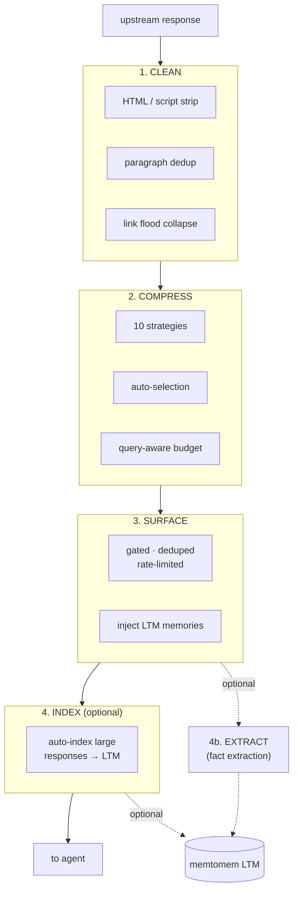
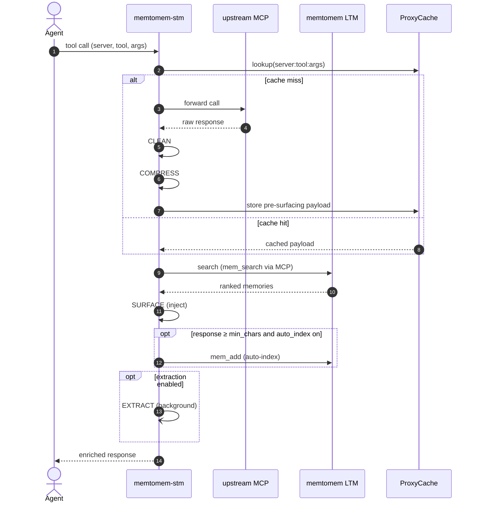

# Pipeline

Every proxied tool call that returns a successful text response goes through 4 stages (plus an optional 4b for fact extraction). Non-text responses (images, binary data) and error responses are passed through without processing.



The CLEAN → COMPRESS → SURFACE → INDEX path is synchronous. The optional **4b EXTRACT** stage runs in parallel via a background extractor that does not block the agent response.



## Tool Naming

All upstream tools are exposed with a `{prefix}__{original_name}` naming convention (e.g. `fs__read_file`). Tool descriptions are prefixed with `[proxied]` to distinguish them from the built-in STM control tools. When a tool's compression strategy changes the agent interaction pattern (selective, progressive, or hybrid with `tail_mode: toc`), a convention suffix is appended to the description — e.g. `| TOC response: use stm_proxy_select_chunks` — so the agent knows which follow-up tool to call.

## Stage 1: CLEAN

Removes noise from the upstream response before compression. Each step can be toggled per server or per tool (via `tool_overrides`) in `stm_proxy.json`:

- **`<script>` / `<style>` removal** — content and tags fully stripped before other processing
- **HTML stripping** — removes tags (preserves code fences and generic types like `List<String>`)
- **Paragraph deduplication** — removes identical paragraphs
- **Link flood collapse** — replaces paragraphs where 80%+ lines are links (10+ lines) with `[N links omitted]`
- **Whitespace normalization** — collapses triple+ newlines to double

```json
{
  "cleaning": {
    "enabled": true,
    "strip_html": true,
    "deduplicate": true,
    "collapse_links": true
  }
}
```

## Stage 2: COMPRESS

Reduces response size to save tokens. See [Compression Strategies](compression.md) for the full reference of all 10 strategies.

## Stage 3: SURFACE

Proactively injects relevant memories from a memtomem LTM server. See [Surfacing](surfacing.md) for the gating, dedup, and feedback details.

Surfacing only activates when the compressed response is at least `min_response_chars` (default 5000). For small responses, surfacing is skipped to avoid negative token savings.

**Progressive delivery + surfacing (F6).**  When Stage 2 produces a
progressive chunk (either directly or as a ratio-guard fallback), the
`SurfacingFormatter.injection_mode` determines whether Stage 3 runs:

- `append` / `section` — memory block is placed *after* the chunker
  footer (`\n---\n`), so the `split("\n---\n")[0]` concat rule agents
  use to stitch sequential `stm_proxy_read_more` calls still recovers
  the original content byte-for-byte. Surfacing runs normally and the
  `surfacing_on_progressive_ok` metric is recorded.
- `prepend` — memory block would be placed *before* the chunk content
  and shift downstream byte offsets. Stage 3 is skipped, a one-time
  WARNING is logged, and `surfacing_on_progressive_ok` stays `None`.
  Users who want progressive surfacing should switch `injection_mode`
  to `append` or `section`.

**Failure guard (S1).**  If `record_surfacing` fails (e.g. SQLite
contention), the engine drops the `surfacing_id` — the memory block
is still injected but without a feedback ID.  The agent cannot
submit feedback for that event, but the response is never blocked.
Logged at WARNING.

**Failure guard (F6).**  If surfacing fails on the progressive path
(LTM outage, timeout, …), `ProxyManager` catches, logs WARNING, and
returns the compressed progressive chunk unchanged so
`stm_proxy_read_more` continues to work. `surfacing_on_progressive_ok`
is recorded `False` and `surface_error` carries the exception class
name.

## Stage 4: INDEX (optional)

Automatically indexes large responses to memtomem LTM for future
retrieval.  See [Caching & Auto-Indexing](caching.md#auto-indexing)
for configuration and
[Custom Integration](custom-integration.md) for `FileIndexer` wiring.

**Failure guard (F1).**  If `_auto_index_response` raises,
`ProxyManager` catches at `manager.py:1346`, logs WARNING with
traceback, and returns the pre-index response unchanged.  The agent
receives a successful result; the response is just not searchable
in LTM.

**Background mode (F4).**  Setting `auto_index.background = true`
schedules the indexing task via `asyncio.create_task` off the request
path. The agent receives a `[Indexing…] · scheduled` placeholder
footer synchronously — the namespace is intentionally dropped from
the placeholder because chunk count and final namespace binding are
unknown until the task runs. `index_ok` / `index_error` /
`chunks_indexed` stay `NULL` / `NULL` / `0` in `proxy_metrics.db`,
matching the tri-state used by background extraction; filter
background rows with `WHERE index_ok IS NULL`. Trade-off:
read-your-own-writes consistency is no longer guaranteed until the
task completes. Default `false` preserves the synchronous contract.

## Stage 4b: Auto Fact Extraction (optional)

Automatically extracts discrete facts from tool responses using an LLM. Strategies: `llm` (default, Ollama qwen3:4b with no-think mode), `heuristic`, `hybrid`, `none`. Each extracted fact is stored as an individual `.md` file and indexed; deduplication via embedding similarity (threshold 0.92).

```json
{
  "extraction": {
    "enabled": true,
    "strategy": "llm",
    "llm": {
      "provider": "ollama",
      "model": "qwen3:4b"
    }
  }
}
```

Per-tool override: `"extraction": true|false` in `tool_overrides` or `UpstreamServerConfig`.

## Durability of Persisted State

The selective (`PendingStore`) and progressive (`ProgressiveStoreAdapter`) compressors persist stored selections in `~/.memtomem/pending_selections.db` so they survive restarts and can be shared across instances (see [Operations → Horizontal Scaling](operations.md#horizontal-scaling)). If an entry on disk is unreadable — corrupted `chunks_json`, truncated `__meta__`, or missing `__content__` — STM logs a warning and **skips the entry** instead of raising:

| Persisted field | Corruption behaviour |
|-----------------|----------------------|
| `pending_selections.chunks_json` | JSON decode error → `get()` returns `None` (the key is treated as a cache miss) |
| Progressive `__meta__` | JSON decode error → `meta = {}`, defaults fill `total_lines`, `content_type`, `structure_hint`, `ttl_seconds`, `access_count` |
| Progressive `__content__` | Missing → `get()` returns `None` |

This is expected behaviour: on-disk state is a best-effort cache, not the source of truth, so the agent sees a fresh response regenerated by the upstream tool rather than an error. If you see these warnings repeatedly, inspect the SQLite file (disk pressure, concurrent writes from a non-WAL client) rather than filing a bug.
